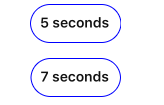
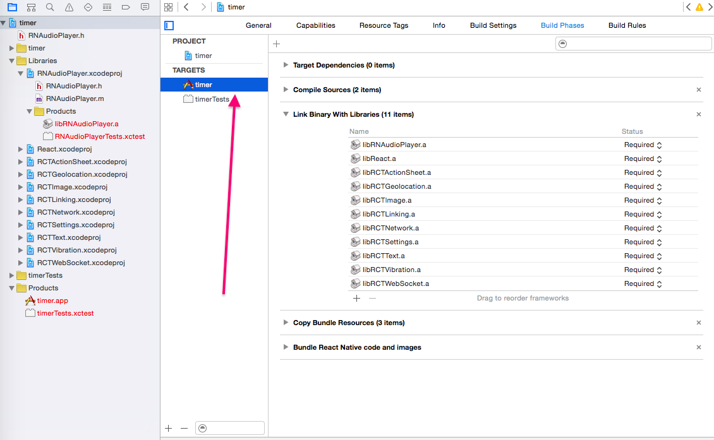
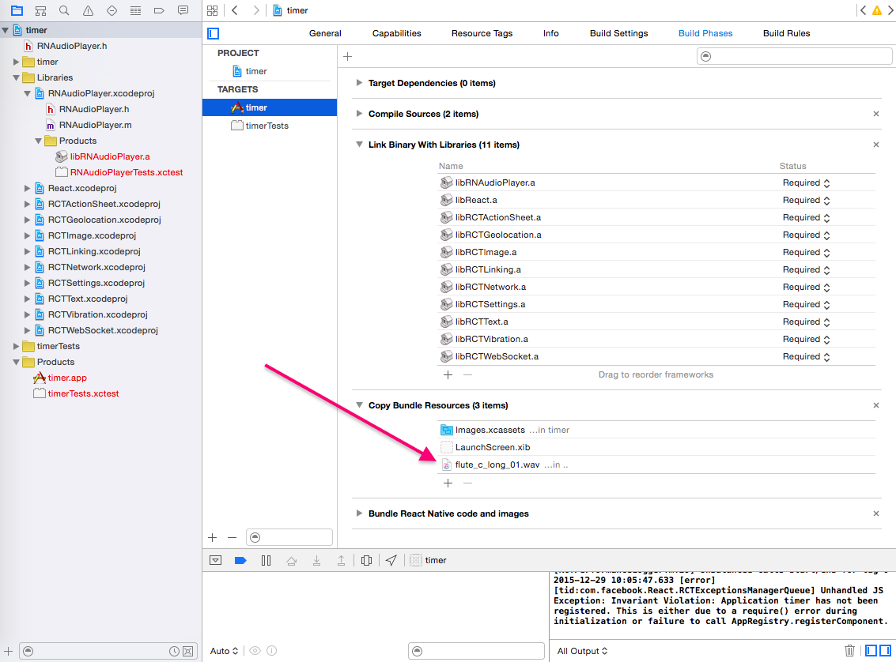
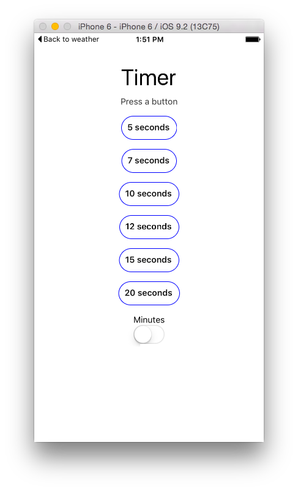
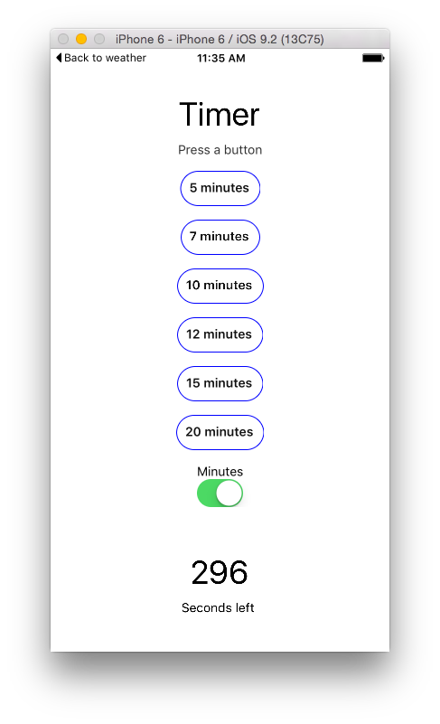
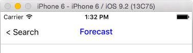
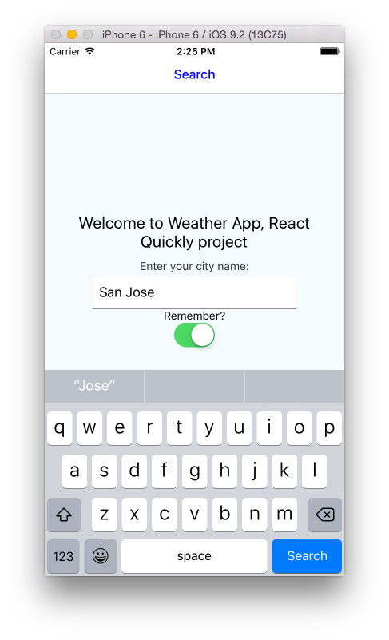

In this book, I'll introduce you to React Native for native mobile iOS and Android development... and do it quickly. We'll cover topics such as

* Why React Native is Awesome
* Setting up React Native Development for iOS
* Hello World and the React Native CLI
* Styles and Flexbox
* Main React Native UI components
* Importing Modules into an Xcode Project
* Project: Timer
* Project: Weather App

This book is about getting started with React quickly and not about React Native, which is technically a separate library (or some might even call it a framework). But I figured after eight chapters of working with React for web development, it would be fun to apply our knowledge to mobile development by leveraging this awesome library. You'll be amazed how many React Native skills you already know from React.

There's always a balance between making examples too complex or too simple, and thus unrealistic and useless. In this book get ready to build two mobile apps: Timer and Weather apps. The Weather app has 3 screencasts which you can watch at [Node.Unversity](http://node.university/courses/react-native-quickly). They will walk you through the Weather app. Enjoy!

# Why React Native is Awesome

React Native apps are not the same as hybrid or so-called HTML5 apps. If you are not familiar with the hybrid approach, it's when there's a website wrapped in a headless browser. A headless browser is a browser view without the URL bar or navigation buttons. Basically, developers build responsive websites using regular web technologies like JavaScript, HTML, and CSS, and maybe a framework like jQuery Mobile, Ionic, Ember, or Backbone. Then they package it as a native app together with this headless browser. In the end you get to reuse the same code base across platforms, but the experience of using hybrid apps is often lacking. They are usually not as snappy, or lack certain features compared to native apps. Among the most popular frameworks for hybrid apps are Sencha Touch, Apache Cordova, PhoneGap, and Ionic.

A React Native app, on the other hand, is not a website wrapped in a headless browser. It's native Objective C or Java code that communicates with React's JavaScript. This allows for the following benefits over native development:

* Hot/live reload. Developers can reload their apps without recompiling them, which speeds up development and eliminates the need for complex What You See Is What You Get (WYSIWYG) editors and IDEs.
* Flexbox layout system. This is a synthesized system for layouts that is similar to CSS and allows for cross-platform development.
* Chrome debugging. Developers can use the already familiar DevTools.
* Write once and make it work across platforms.
* Port from web React easily, for example with frameworks like [ComponentKit](http://componentkit.org).
* Leverage the vast amount of open-source tools, utilities, libraries, knowledge, best practices, ES6/7+, and books on JavaScript (the most popular programming language in the world).
* Use native elements, which are better and more powerful than web tech (the HTML5/wrapper approach).
* React. No specific data binding, event management, or micromanaging of views, all of which tend to increase complexity. React uses a declarative approach and simple-to-scale unidirectional data flow.

For these reasons, it's no surprise that large and small companies alike are jumping on the React Native train and abandoning both hybrid and native approaches. Every day I read blog posts saying that such and such company or some iOS developer has switched to React Native, and how they are happy with the move. Are you ready to get started with what seems to be the next generation of mobile development?

# Setting up React Native Development

This chapter deals only with React Native development for iOS. I'll be using only universal cross-platform components—for example, `Navigator` and not `NavigatorIOS`—so the code provided should work for Android too. However, I won't go into the details of how you would compile Android projects.

If you don't work on Apple hardware with Mac OS X, you can install a virtual machine running Mac OS X on a Linux or Windows OS by following [this guide](https://blog.udemy.com/xcode-on-windows). Moving forward, I assume we are all working on Mac OS X, either virtual or not, to build iOS apps.

To get everything installed, you can do it manually or use a package manager. Since we're working in a Mac OS X environment, I recommend using Homebrew (a.k.a. brew) to install some of the required tools. If you don't have Homebrew already, you can go to its website, <http://brew.sh>, or run this Ruby command (Mac OS X comes with Ruby):

```bash
$ ruby -e "$(curl -fsSL https://raw.githubusercontent.com/Homebrew/install/master/install)"
```

We will need the following tools and libraries:

* Node.js v5.1 and npm v3.3.12—If you read chapters 1-8, you should have them already. If you jumped right here, follow the instructions in appendix B.
* Watchman v4.1.0—This tool will monitor and update according to source code file changes. Use `$ brew install watchman@4.1.0` to install it.
* Google Chrome—The browser will allow you to debug React Native apps during development. Here's [the link to download it](https://www.google.com/chrome/browser/desktop/index.html).
* React Native CLI v0.1.7—This tool will allow you to create boilerplates for your React Native apps. Install it with `$ npm install -g react-native-cli@0.1.7`.
* Xcode v7.2—IDE, compilers, and SDKs for iOS, OS X, tvOS, and watchOS. To install it, click the link at <https://developer.apple.com/xcode/download> to open the [Mac App Store](https://itunes.apple.com/us/app/xcode/id497799835).
* Flow—A static type checker for JavaScript. To install it with Homebrew, run `$ brew install flow@0.19.1`.

I recommend using NVM v0.29.0, n, or a similar Node version manager. This step is optional but recommended because it means you can switch to Node.js v5.1 even if your main version is more recent. To use Homebrew, execute `$ brew install nvm` and follow the instructions.

Your system should be ready for the development of iOS apps. Let's start with the quintessential programming example, Hello World.

# Hello World and the React Native CLI

First, navigate into the folder where you want to have your project. Mine is /Users/azat/Documents/Code/react/ch9/. Then run the `$ react-native init` terminal command to initiate the project by creating iOS and Android projects, package.json, and other files and folders:

```bash
$ react-native init hello
```

Wait. It might take some time. There are a few things happening at this moment. Obviously, the folder hello is created. Then, the tool creates package.json. (I love how Node and npm are everywhere nowadays. This wasn't the case in 2012!) In package.json, the `react-native` CLI, which is global, puts a local dependency, `react-native`. This is similar to running `$ npm i react-native --save`.

After that step, the global `react-native` CLI runs the local code from the `hello/node_modules/react-native/local-cli/cli.js` file, and that in turn runs the helper bash script `hello/node_modules/react-native/init.sh`. That bash script creates scaffolding with React Native code in the index.ios.js and index.android.js files as well as iOS and Android projects in the ios and android folders.

In the ios folder, the tool creates Xcode project files with Objective C code. That's our focus right now. Here's the boilerplate folder structure created by the tool:

```
/android
  /app
  /gradle
  - build.gradle
  - gradle.properties
  - gradlew
  - gradlew.bat
  - settings.gradle
/ios
  /hello
  /hello.xcodeproj
  /helloTests
/node_modules
  - ...
- index.android.js
- index.ios.js
- package.json
- .watchman.config
- .flowconfig
```

Once everything is generated, you'll be returned to the command prompt. The output on my computer was this, which even tells me how to start the apps:

```
To run your app on iOS:
   Open /Users/azat/Documents/Code/react/ch9/hello/ios/hello.xcodeproj in Xcode
   Hit the Run button
To run your app on Android:
   Have an Android emulator running (quickest way to get started), or a device connected
   cd /Users/azat/Documents/Code/react/ch9/hello
   react-native run-android
```

You have two options. You can manually open Xcode and select Open (Command+O) from the File menu, open the hello.xcodeproj file, and click the black rectangle to build and run. Or you can navigate into the folder with `$ cd hello`, run `$ open ios/hello.xcodeproj`, and click on "play" in Xcode to build and run.

If you followed the steps correctly, you will see a new terminal window that says React Packager. It starts with a message:

```
 ~/Documents/Code/react/ch9/hello/node_modules/react-native/packager ~
 ┌────────────────────────────────────────────────────────────────────────────┐
 │  Running packager on port 8081.                                            │
 │                                                                            │
 │  Keep this packager running while developing on any JS projects. Feel      │
 │  free to close this tab and run your own packager instance if you          │
 │  prefer.                                                                   │
 │                                                                            │
 │  https://github.com/facebook/react-native                                  │
 │                                                                            │
 └────────────────────────────────────────────────────────────────────────────┘
Looking for JS files in
   /Users/azat/Documents/Code/react/ch9/hello

[12:15:42 PM] <START> Building Dependency Graph
[12:15:42 PM] <START> Crawling File System
[12:15:42 PM] <START> Loading bundles layout
[12:15:42 PM] <END>   Loading bundles layout (0ms)
```

So what is happening here? React Native packages our React Native JavaScript files and serves them on localhost:8081. That's right, it's just like any other web server if you open your browser at <http://localhost:8081/index.ios.bundle?platform=ios&dev=true>. Open it in your browser now. Search for "hello". You will see the React Native code bundled up together in one big file. This should sound familiar to most web developers. ;-)

Where did I get the <http://localhost:8081/index.ios.bundle?platform=ios&dev=true> URL? It's in the hello/ios/hello/AppDelegate.m file, on line 34 (you are using the same version as me, right?):

```
jsCodeLocation = [NSURL URLWithString:@"http://localhost:8081/index.ios.bundle?platform=ios&dev=true"];
```

The Objective C code grabs the JavaScript from the server. That's default option number one. There's a second option, which is commented at the moment. It takes the JavaScript code from the static file (line 42 in the same file). It's good to have options!

The comments tell us how we can spin up the server. It's just the `$ npm start` command, which runs `$ react-native start`, so we can use the latter too. So if you are switching between projects or you don't want to use the terminal process opened automatically by Xcode, you can always start a new server. Just keep in mind, as with any server, that you cannot have two of them listening on the same port. Therefore, terminate the old process before spinning up a new server on localhost:8081.

It takes some time to launch the Simulator window. I prefer working with iPhone 6, not iPhone 6 Plus. This way I have more space for development on my screen. By now you should have the Simulator window opened. Poke around. There's not much to see, as shown in figure 1.

Go ahead and open the index.io.js file. You can see the familiar-looking JavaScript/Node code. If you're not comfortable with ES6 yet (or ES2015—its official name), take a look at chapter 10 and appendix I.

At the beginning of the file, there's a destructuring statement to import objects from React Native:

```js
var React = require('react-native');
var {
  AppRegistry,
  StyleSheet,
  Text,
  View,
} = React;
```

Next, you can see your good old friend `React.createClass()` with the `render` method:

```js
var hello = React.createClass({
	render: function() {
		return (
			<View style={styles.container}>
        		<Text style={styles.welcome}>
		          Welcome to React Native!
		        </Text>
	    	    <Text style={styles.instructions}>
	        	  To get started, edit index.ios.js
		        </Text>
		        <Text style={styles.instructions}>
					Press Cmd+R to reload,{'\n'} Cmd+D or shake for dev menu
	        	</Text>
		     </View>
		);
	}
});
```

Gosh, with good comments like this I'll soon be out of business—meaning I won't need to write books. ;-) As they say, pressing Command+R in the Simulator will reload it. Go ahead and change "Welcome to React Native!" to "Hello World!" Save index.ios.js, and reload the app in the Simulator window.

Note: If you are using some nonstandard keyboard layout like Dvorak or Colemak (as I do), in the Simulator window you will have to use the standard US layout for the shortcuts, and for typing text as well.

Observe the changes and notice how we didn't have to rebuild the Xcode project. Watchman updated the package after we saved the file. The new code was served on the server at localhost:8081. You can see the text "Hello World!" in the browser if you go to <http://localhost:8081/index.ios.bundle?platform=ios&dev=true>. Once we reloaded the Simulator, the new code was there!

There are two more interesting things in index.ios.js (and then we'll move on to exploring each component individually): `StyleSheet` and `AppRegistry`. They are not in web React, so let me explain them.

# Styles and Flexbox

The former is a way to create layout, styles, and formatting in the elements. We create an object with `StyleSheet.create()`. For example, these are our Hello World styles:

```js
var styles = StyleSheet.create({
  container: {
    flex: 1,
    justifyContent: 'center',
    alignItems: 'center',
    backgroundColor: '#F5FCFF',
  },
  welcome: {
    fontSize: 20,
    textAlign: 'center',
    margin: 10,
  },
  instructions: {
    textAlign: 'center',
    color: '#333333',
    marginBottom: 5,
  },
});
```

I hope you can guess the meaning of some of the properties, like `backgroundColor` and `fontSize`. They are similar to `background-color` and `font-size` in CSS, and you already know that React uses camelCase instead of dashes. Other style properties, like `flex`, are specific to React Native. This is what they mean: <!-- RH Are there supposed to be descriptions of these properties in the following list? Is that what the "TK" means? -->

* `flex`
* `justifyContent`
* `alignItems` TK
* `flexDirection`

The numbers in the style properties are points, not pixels. The difference is that points can mean 1 or more pixels depending on the screen, so using points liberates developers from writing `if/else` conditions for various screen formats. Most notably, on old iPhones like the iPhone 3GS 1 point is 1 pixel (1:1). On the other hand, on new iPhones with Retina screens, such as the iPhone 6, 1 point is a 2x2 square of pixels (1:2).

The last statement of the file is akin to `ReactDOM.render()` from web React development:

```js
AppRegistry.registerComponent('hello', () => hello);
```

It registers our component, `hello`, in the registry. You can change the name in the fat arrow function (the second argument) to anything else, but refrain from changing the first argument. ES6 fat arrows are covered in chapter 10 and appendix I. Right now, let's explore the React Native components in more detail.

# Main React Native UI Components

You might have noticed that in the `render` method we use special tags/elements like `<View>` and `<Text>` instead of `<div>` or `<p>`. Those special elements or React Native components come from the `react-native` library. There are whole bunch of them in there, and I'm sure more will come soon. There are components specific to iOS and Android as well as synthetic ones that would work across platforms. Typically, iOS-only components have `IOS` at the end of their name (for example, `NavigatorIOS`) while the universal cross-platform components don't have such endings (for example, `Navigator`).

Describing all the React Native components would take a book on its own. Also, as I've said before, the community and Facebook developers themselves constantly and relentlessly add new components and update existing ones. It's better to refer to [the official documentation](https://facebook.github.io/react-native/docs/getting-started.html) for the full up-to-date list of supported components. However, to be able to develop minimal mobile apps with React Native, you'll need to learn the main (in my mind) components. They are:

* `View`—Basic view component. Every render must have at least an empty `View`.
* `Text`—Text component. All text must be wrapped in this component, unlike text in web React.
* `TextInput`—Form input field component. Use it to capture user input.
* `ScrollView`—View with scrollable content. Use it when your content won't fit on one screen.
* `ListView`—View with structured data. Use it to output lists or tables.
* `TouchableHighlight`—User touch component. Use it to capture user touch events, similar to anchor tags in web development.
* `Switch`—Boolean on/off switch. Use it for settings and forms.
* `Navigator`—Highly customizable navigation component. Use it to navigate between screens and implement a navigation bar and/or breadcrumbs navigation bar.

All these components were selected because knowing them will provide you with the bare minimum to build somewhat useful apps, as you'll see in the Timer and Weather App projects. Also, these components are universal; that is, you can (and should) use them for iOS and Android. Maybe you can even use the same code base for index.ios.js and index.android.js.

For this section of the book, I'll be using code snippets from the Timer and Weather App projects to make the examples more realistic than just some foo-bars. The code for Timer is in `timer`. The code for Weather App is in `weather`.

## View

As I mentioned before, `View` is the most basic component. If you don't know what to use, then use `View`. You can wrap multiple other components in a `View`, similarly to wrapping them in a `<div>`, because `render()` must return *only a single element*. For example, to output the number of seconds left and a label underneath it, wrap them in a `View`:

```js
var Timer = React.createClass({
   render() {
     // ...
     return (
       <View>
         <Text style={styles.heading}>{this.props.time}</Text>
         <Text>Seconds left</Text>
       </View>
     )
    }
})
```

## Text

The `Text` component is for rendering text. Like most of the other components, we can supply it with styles. For example, this `Text` element is using Flex and has a font size of 36, padding on top of 40, and a margin of 10:

```js
var TimerWrapper = React.createClass({
  // ...
  render() {
    return (
      <ScrollView>
        <View style={styles.container}>
          <Text style={styles.heading}>Timer</Text>
         ...
        </View>
      </ScrollView>
    )
  }
})

var styles = StyleSheet.create({
  ...
  heading: {
    flex: 1,
    fontSize: 36,
    paddingTop: 40,
    margin: 10
  },
  ...
})
```

The result is shown in Figure 1.


Conveniently, we can combine two or more style objects in the `style` property using an array. For example, this `Text` element uses styles from `navBarText` and `navBarButtonText`:

```html
        <Text style={[styles.navBarText, styles.navBarButtonText, ]}>
          {'<'} {previousRoute.name}
        </Text>
```

The `style` attribute and combining of styles are not exclusive to `Text`. You can apply them to other components.

## TextInput

`TextInput` is an input field component. You would typically use it in forms to capture user input such as email address, password, name, etc. This component has some familiar properties, such as:

* `placeholder`—Example text that will be shown when the value is empty
* `value`—The value of the input field
* `style`—A style attribute

Other attributes are specific to React Native. The main ones are:

* `enablesReturnKeyAutomatically`—If `false` (the default value), prevents a user from submitting an empty text value by disabling the return key.
* `onChange`—The method to invoke on value change. Passes the event object as the argument.
* `onChangeText`—The method to invoke on value change. Passes the text value as the argument.
* `onEndEditing`—The method to invoke when the user presses the return key on the virtual keyboard.
* `multiline`—If `true` (default is `false`), the field can take multiple lines.
* `keyboardType`—One of the enumerator values, such as `'default'`, `'numeric'`, or `'email-address'`.
* `returnKeyType`—Enumerator for the return key, such as `'default'`, `'go'`, `'google'`, `'join'`, `'next'`, `'route'`, `'search'`, `'send'`, `'yahoo'`, `'done'`, or `'emergency-call'`. iOS only.

The full list of up-to-date properties for `TextInput` for iOS and Android is at <https://facebook.github.io/react-native/docs/textinput.html#props>.

Consider this example, which renders a city name input field with the handler `this.search`. The button on the keyboard will say Search, the value is assigned to the state (a controlled component!), and the placeholder is San Francisco:

```html
  <TextInput
    placeholder="San Francisco"
    value={this.state.cityName}
    returnKeyType="search"
    enablesReturnKeyAutomatically={true}
    onChangeText={this.handleCityName}
    onEndEditing={this.search}
    style={styles.textInput}/>
```

The result is shown in Figure 2, where you can observe the Search key on the virtual keyboard.


With the `onChangeText` property, we get the value of the input field as the argument to the handler function (`handleCityName(event)`). For example, to process the name of the city and set the state of `cityName` in a controlled component, we need to implement `handleCityName` like this:

```js
  ...
  handleCityName(cityName) {
    this.setState({ cityName: cityName})
  },
  ...
```
On the other hand, if you need more than text, there's `onChange`. When the event comes to the `onChange` handler function, the `event` argument has a property called `nativeEvent`, and this property in turn has a property called `text`. You can implement the `onChange` handler like this:

```js
...
onNameChanged: function(event) {
  this.setState({ name: event.nativeEvent.text });
},
...
render() {
  return (
    <TextInput onChange={this.onNameChange} ... />
  )
}
})
```


## ScrollView

This is an enhanced version of the `View` component. It allows for the content to be scrollable, so you can scroll up and down with touch gestures. This is useful when the content won't fit on one screen. For example, I can use `ScrollView` as the root of my `render()` because I know that `timerOptions` can be a very large array, thus rendering many rows of data (`Button` components):

```js
var TimerWrapper = React.createClass({
  // ...
  render() {
    return (
      <ScrollView>
        <View style={styles.container}>
          <Text style={styles.heading}>Timer</Text>
          <Text style={styles.instructions}>Press a button</Text>
          <View style={styles.buttons}>
            {timerOptions.map((item, index, list)=>{
              return <Button key={index} time={item} startTimer={this.startTimer} isMinutes={this.state.isMinutes}/>
            })}
          </View>
		  ...
        </View>
      </ScrollView>
    )
  }
})
```

## ListView

`ListView` is a view that renders a list of rows from the data provided. In most cases, you want to wrap a `ListView` in a `ScrollView`. The data must be in a certain format. Use `dataSource = new ListView.DataSource()` to create the data source object, then use `dataSource.cloneWithRows(list)` to populate the data source with data from a standard JavaScript array.

Here is an example. First we create the data source object:

```js
let dataSource = new ListView.DataSource({
  rowHasChanged: (row1, row2) => row1 !== row2
})
```

Then we use the `cloneWithRows` method to fill in the data from an array, `response.list`:

```js
this.props.navigator.push({
  name: 'Forecast',
  component: Forecast,
  passProps: {
    forecastData: dataSource.cloneWithRows(response.list),
    forecastRaw: response
  }
})
```

Ignore the `navigator` call for now. It's coming up later in the chapter.

We have the data, so now let's render the `ListView` by providing the properties `dataSource` and `renderRow`. For example, this is the list of forecast info, with each row being a forecast on a certain day. The `ListView`'s parent is `ScrollView`:

```js
module.exports = React.createClass({
  render: function() {
    return (
      <ScrollView style={styles.scroll}>
        <Text style={styles.text}>{this.props.forecastRaw.city.name}</Text>
        <ListView dataSource={this.props.forecastData} renderRow={ForecastRow} style={styles.listView}/>
      </ScrollView>
    )
  }
})
```

As you can guess, `renderRow`, which is `ForecastRow` in this example, is another component that is responsible for rendering an individual item from the data source provided. If there are no methods or states, you can create a stateless component (more on stateless components in chapter 10). In the `ForecastRow`, we output the date (`dt_txt`), description (`description`), and temperature (`temp`):

```js
const ForecastRow = (forecast)=> {
  return (
    <View style={styles.row}>
      <View style={styles.rightContainer}>
        <Text style={styles.subtitle}></Text>
        <Text style={styles.subtitle}>
          {forecast.dt_txt}: {forecast.weather[0].description}, {forecast.main.temp}
        </Text>
       </View>
    </View>
  )
}
```

You can achieve the functionality of `ListView` with a simple `Array.map()` construct. In this case, there's no need for a data source.

## TouchableHighlight

`TouchableHighlight` captures user touch events. Developers implement buttons akin to anchor (`<a>`) tags in web development. The action is passed as the value of the `onPress` property. To implement a button, we also need to put some text inside of it.

For example, this is a button that triggers `startTimer` and has text that consists of the `time` property and either the word "minutes" or "seconds":

```js
var Button = React.createClass({
  startTimer(event) {
    // ...
  },
  render() {
    return (
      <TouchableHighlight onPress={this.startTimer}>
        <Text style={styles.button}>{this.props.time} {(this.props.isMinutes) ? 'minutes' : 'seconds'}</Text>
      </TouchableHighlight>
    )
  }
})
```

The style of `TouchableHighlight` by itself is nothing; for this reason, when we implement buttons we either style the text inside of the `TouchableHighlight` (Figure 3) or use an image with the `Image` component.



Similar components to `TouchableHighlight` are:

* `TouchableNativeFeedback`
* `TouchableOpacity`
* `TouchableWithoutFeedback`


## Switch

You've probably seen and used the `Switch` component or a similar native element many times. A visual example is shown in Figure 9-X. It's a small toggle that is not dissimilar to a checkbox. This is a Boolean on/off input element that comes in handy in forms and app settings.


When implementing `Switch`, you provide at least two properties, `onValueChange` and `value` (a controlled component again!). For example, this toggle makes the apps save the city name, or not:

```js
      ...
        <Text>Remember?</Text>
        <Switch onValueChange={this.toggleRemember} value={this.state.isRemember}></Switch>
      ....
```

In the handler `toggleRemember`, I set the state to the value that is the opposite of the current `this.state.isRemember`:

```js
  // ...
  toggleRemember() {
    this.setState({ isRemember: !this.state.isRemember}, ()=>{
      // Remove the city name from the storage
      if (!this.state.isRemember) this.props.storage.removeItem('cityName')
    })
  },
  // ...
```

## Navigator

`Navigator` is a highly customizable navigation component to enable navigation between screens in the app. We can use it to implement a navigation bar and/or a breadcrumbs navigation bar. A navigation bar is a menu at the top of the screen with buttons and a title.

There's also `NavigatorIOS`, which is not used by Facebook and therefore not officially supported and maintained by the community. `NavigatorIOS` has a built-in navigation bar, but it works only for iOS development. Another drawback is that `NavigatorIOS` won't refresh routes/screens when the properties to those routes change. Conversely, `Navigator` can be used on iOS and Android, and it refreshes the routes on the change of the properties passed to them. You can customize navigation bars to your liking.

Because `Navigator` is flexible, I found a few ways to implement it. There is a method where you have a route stack and then navigate by using route IDs and forward/back methods. I settled on this pattern, which uses abstraction and the `NavigatorIOS` interface (`passProps`). Let's say the `App` component is the one you register with `AppRegistry`. Then you want to render the `Navigator` in `App`'s `render` method:

```js

const App = React.createClass({
  render() {
    return (
      <Navigator
        initialRoute={{
          name: 'Search',
          index: 0,
          component: Search,
          passProps: {
            storage: storage
          }
        }}
        ref='navigator'
        navigationBar={
          <Navigator.NavigationBar
            routeMapper={NavigationBarRouteMapper}
            style={styles.navBar}
          />
        }
        renderScene={(route, navigator) => {
          let props = route.passProps
          props.navigator = navigator
          props.name = route.name
          return React.createElement(route.component, props)
        }}
      />
    )
  }
})
```

You can observe several attributes of `Navigator`:

* `initialRoute`—The very first `route` object we render.
* `ref`—The property of the `App` element that will have the `Navigator` object. We can use it to jump to new scenes.
* `navigationBar`—The top menu with title and left and right buttons.
* `renderScene`—The method that is triggered on the navigation event for every route. We get the `route` object and render the component using `route.component` and `route.passProps`.

To navigate to a new screen like Forecast (`Forecast` component) and pass properties to it, invoke `navigator.push()`:

```js
		// ...
        this.props.navigator.push({
          name: 'Forecast',
          component: Forecast,
          passProps: {
            forecastData: dataSource.cloneWithRows(response.list),
            forecastRaw: response
          }
        })
        // ...
```

In this example, I'm passing the component and props with each `push()` call. If you're using a route stack, which is basically a list of components, then you can pass only an ID or the name of a component, not the entire object, and get the object from the stack. As usual, there's more than one way to skin a catfish.

# Importing Modules into the Xcode Project

What if you want to use a community React Native component, i.e., something that is not part of `react-native`, but is provided as a standalone npm module? You can import a module into your project!

In Timer, we need to play the sound when time is up. There's no official component for sounds as of this writing (Jan 2016), but there are several userland modules. One of them is [`react-native-audioplayer`](https://github.com/andreaskeller/react-native-audioplayer). First, install it with npm in the project folder:

```
$ npm install react-native-audioplayer@0.2.0 --save
```

We're focusing on iOS at the moment, so the installation is as follows:

1. Open your project in Xcode.
2. In Xcode, find the Project Navigator in the left sidebar.
3. In the Project Navigator, right-click Libraries.
4. In the context menu, click Add Files to "timer". (Substitute another project name for "timer" if needed.)
5. Navigate to `node_modules/react-native-audioplayer`. Add the file `RNAudioPlayer.xcodeproj`. The result is shown in Figure 5.


6. In the Project Navigator, select your project (timer).
7. Click the build target for timer in the Targets list (figure 9-X).



8. Click on the Build Phases tab to open it.
9. Expand Link Binary With Libraries by clicking on it.
10. Click on the plus button (+) and add libRNAudioPlayer.a under Workspace, or just drag and drop libRNAudioPlayer.a from the Project Navigator. It's under `Libraries/RNAudioPlayer.xcodeproj/Products`.
11. Run your project (press Command+R or click the black rectangle signifying "play").


If you did everything correctly, in the index.ios.js file, you can import the module with `require()`:

```js
AudioPlayer = require('react-native-audioplayer')
```

And play the sound with `play()`:

```js
AudioPlayer.play('flute_c_long_01.wav')
```

The sound file needs to be included in the bundle. To do so, select Copy Bundle Resources and add `flute_c_long_01.wav`, or your own sound file as shown in Figure 7.



That's all the prep. Now we can implement Timer!

# Project: Timer

You've seen bits and pieces from the Timer app (Figure 8), which is in `timer`. I think it will be beneficial if we go through the implementation at once. The main file is `index.ios.js`. It has three components, not unlike my browser/web React Timer from React Quickly (Manning, 2016), ([GitHub](https://github.com/azat-co/react-quickly/tree/master/projects/timer)):

* `TimerWrapper`—A smart component that has most of the logic for the timer
* `Timer`—A dumb component that plays the sound when the time is up and displays the number of seconds left
* `Button`—A component that shows a button and triggers the start of the countdown by invoking the handler passed to it by the parent (`TimerWrapper`)




We start the index.ios.js file with importations of React Native, its objects, and Audio Player:

```js
'use strict'

var React = require('react-native'),
  AudioPlayer = require('react-native-audioplayer')

var {
  AppRegistry,
  StyleSheet,
  Text,
  View,
  ScrollView,
  TouchableOpacity,
  Switch
} = React
```

The next statement declares the array of options for the Timer buttons, which we will turn into either number of seconds or number of minutes by using `Switch`:

```js
const timerOptions = [5, 7, 10, 12, 15, 20]
```

I enhanced `TimerWrapper` from the chapter 5 project with the dynamic generation of buttons and the seconds to minutes switch. The switch is using the `isMinutes` state, so let's set it to `false` at the beginning. Just to remind you, this example uses some ES6+/ES2015+ syntax. If you are not familiar with it or are not sure whether you're familiar with it, check out chapter 10 and appendix I.

```
var TimerWrapper = React.createClass({
  getInitialState () {
    return {time: null, int: null, isMinutes: false}
  },
```

The initial value of `isMinutes` is `false`. `toggleTime` is the handler for the `Switch`. We flip the value of `isMinutes` with the logical not (`!`). It's important to set the time to `null`, as otherwise the sound will be triggered each time we flip the switch. The sound play is conditioned on `time` being `0`, so if we set it to `null`, it won't play. The sound logic is in the `Timer` component. The React algorithm decides to re-render it when we change the state of `isMinutes`:

```js
  toggleTime(){
    let time = this.state.time
    if (time == 0 ) time = null
    this.setState({isMinutes: !this.state.isMinutes, time: time})
  },
```

The next method starts the timers. If you followed the project in chapter 5, you know how it works. React Native provides an API for timers, i.e., `clearInterval()` and `setInterval()` as global objects. The number in the `time` state is always in seconds, even if we see minutes on the buttons and the switch is turned on:

```js
  startTimer(time) {
    clearInterval(this.state.int)
    var _this= this
    var int = setInterval(function() {
      console.log('2: Inside of setInterval')
      var tl = _this.state.time - 1
      if (tl == 0) clearInterval(int)
      _this.setState({time: tl})
    }, 1000)
    console.log('1: After setInterval')
    return this.setState({time: time, int: int})
  },
```

In the `render` method, we are using a simple `map()` iterator to generate a column of buttons. It's wrapped in a `ScrollView`, so you can really go crazy with the `timerOptions` array by adding more elements, and see what has happened:

```html
  render() {
    return (
      <ScrollView>
        <View style={styles.container}>
          <Text style={styles.heading}>Timer</Text>
          <Text style={styles.instructions}>Press a button</Text>
          <View style={styles.buttons}>
            {timerOptions.map((item, index, list)=>{
              return <Button key={index} time={item} startTimer={this.startTimer} isMinutes={this.state.isMinutes}/>
            })}
          </View>
```

After the buttons, we have a text label that says Minutes and the `Switch` controlled component:

```html
          <Text>Minutes</Text>
          <Switch onValueChange={this.toggleTime} value={this.state.isMinutes}></Switch>
          <Timer time={this.state.time}/>
        </View>
      </ScrollView>
    )
  }
})
```

The buttons we render in `TimerWrapper` come from this component. It has a ternary condition (a.k.a. the Elvis operator) to set either minutes, by multiplying them by 60 (60 seconds in a minute), or seconds:

```js
var Button = React.createClass({
  startTimer(event) {
    let time = (this.props.isMinutes) ? this.props.time*60 : this.props.time
    return this.props.startTimer(time)
  },
```

When rendering, we use `TouchableOpacity`, which is functionally similar to `TouchableHighlight` but differs in visual representation (it's transparent when touched). There is a ternary condition to output the word "minutes" or "seconds" based on the value of the `isMinutes` property:

```js
  render() {
    return (
      <TouchableOpacity onPress={this.startTimer}>
        <Text style={styles.button}>{this.props.time} {(this.props.isMinutes) ? 'minutes' : 'seconds'}</Text>
      </TouchableOpacity>
    )
  }
})
```

The `Timer` component renders the number of seconds left as well as playing the sound when this number is `0`:

```js
var Timer = React.createClass({
   render() {
     if (this.props.time == 0) {
      AudioPlayer.play('flute_c_long_01.wav')
     }
     if (this.props.time == null || this.props.time == 0) return <View><Text  style={styles.heading}> </Text></View>
     return (
       <View>
         <Text style={styles.heading}>{this.props.time}</Text>
         <Text>Seconds left</Text>
       </View>
     )
    }
})
```

The `styles` object uses Flex. In `container`, there's `flexDirection`, set to `column`. It positions elements vertically, as in a column. Another value is `row`, which will position them horizontally.

```js
var styles = StyleSheet.create({
  container: {
    flex: 1,
    flexDirection: 'column',
    alignItems: 'center'
  },
  heading: {
    flex: 1,
    fontSize: 36,
    paddingTop: 40,
    margin: 10
  },
  instructions: {
    color: '#333333',
    marginBottom: 15,
  },
  button: {
    color: '#111',
    marginBottom: 15,
    borderWidth: 1,
    borderColor: 'blue',
    padding: 10,
  	borderRadius: 20,
    fontWeight: '600'
  },
  buttons: {
    flex: 1,
    alignItems: 'center',
    justifyContent: 'flex-start'
  }
})
```

Lastly, there is the register statement:

```js
AppRegistry.registerComponent('timer', () => TimerWrapper)
```

Now, we can install and import the Audio Player into the Xcode project following the steps in the previous section. Don't forget to include the sound file as well. When you're done, navigate to the ch9/timer folder and start the local server with `$ react-native start`. You should see:

```bash
React packager ready.
```

Go to your Simulator and refresh it. You should see buttons with seconds on them and the switch in the off position. Turn it on to use minutes and the buttons will change. Pressing on 5 minutes will start the countdown showing seconds left, as shown in Figure 9.



I dare you to redesign this little app (make it prettier!), publish it to the App Store, and send me the link. Maybe you can get to the top charts. Flappy Bird did.

# Project: Weather App

The idea of this project is to fetch weather forecasts from the OpenWeatherMap API based on the city name provided by the user (Figure 10). In this project we'll be utilizing `Navigator` to switch between the screens and show a navigation menu on top with a button to go back.


Also, there will be a "remember me" feature to save the entered city name for future uses. The persistence will be implemented with `AsyncStorage`.

The resulting forecast data will be shown in a grid with the date, description, and temperature in F and C, as shown in Figure 11.


To get started, use the scaffolding provided by the React Native CLI tool (if you don't have v0.1.7, follow the instructions at the beginning of this chapter to get it):

```
$ react-native init weather
```

The command will output something like this:

```
This will walk you through creating a new React Native project in /Users/azat/Documents/Code/react/ch9/weather
Installing react-native package from npm...
Setting up new React Native app in /Users/azat/Documents/Code/react/ch9/weather
To run your app on iOS:
   Open /Users/azat/Documents/Code/react/ch9/weather/ios/weather.xcodeproj in Xcode
   Hit the Run button
To run your app on Android:
   Have an Android emulator running (quickest way to get started), or a device connected
   cd /Users/azat/Documents/Code/react/ch9/weather
   react-native run-android
```

Open the iOS project in Xcode with this command:

```
$ open ios/weather.xcodeproj
```

In addition to the already existing `index.ios.js`, create four files, `forecast.ios.js`, `search.ios.js`, `weather-api.js`, and `response.json`, so the project structure looks like this:

```
/weather
  /android
    ...
  /ios
    /weather
      /Base.Iproj
        ...
      /Images.xcassets
        ...
      - AppDelegate.h
      - AppDelegate.m
      - Info.plist
      - main.m
    /weather.xcodeproj
      /project.xcworkspace
        ...
      /xcshareddata
        ...
      /xcuserdata
        ...
      - project.pbxproj
    /weatherTests
      - Info.plist
      - weatherTests.m
  /node_modules
    ...
  - .flowconfig
  - .gitignore
  - .watchmanconfig
  - forecast.ios.js
  - index.android.js
  - index.ios.js
  - package.json
  - response.json
  - search.ios.js
  - weather-api.json
```


The files `search.ios.js` and `forecast.ios.js` will be the components for the first screen, which will have the input field for the city name, and the second screen, which will show the forecast, respectively. But before we start implementing `Search` and `Forecast`, let's code the `App` component and the navigation that will enable us to switch between the Search and Forecast screens.

In the `index.ios.js` file, add the React Native classes shown in the following listing. The only classes that should be unfamiliar to you by now are `AsyncStorage` and `PixelRatio`—everything else was covered earlier in this chapter:

```js
'use strict'

var React = require('react-native')

var {
  AppRegistry,
  StyleSheet,
  Text,
  View,
  Navigator,
  ListView,
  AsyncStorage,
  TouchableOpacity,
  PixelRatio
} = React
```

Import `Search`. The `const` is an ES6 thing. You can use `var` or learn about `const` and `let` in [ES6/ES2016 cheatsheet](https://github.com/azat-co/cheatsheets/tree/master/es6).

```js
const Search = require('./search.ios.js')
```

Now let's create an abstraction for the storage, i.e., `AsyncStorage`. You can use `AsyncStorage` directly, but it's better to have an abstraction like the one shown here. The `AsyncStorage` interface is very straightforward. It uses the `getItem()`, `removeItem()`, and `setItem()` methods. I'm sure you can guess what they mean. The only interesting part is that for `getItem()` we need to utilize `Promise`. The idea behind it is that `getItem()` results are asynchronous. There's more on ES6 promises in [the cheatsheet](https://github.com/azat-co/cheatsheets/tree/master/es6).

```js
const storage = {
  getFromStorage(name, callback) {
    AsyncStorage.getItem(name).then((value) => {
      console.log(`AsyncStorage GET for ${name}: "${value}"`)
      if (value) callback(value)
      else callback(null)
    }).done()
  },
  setInStorage(name, value) {
    console.log(`AsyncStorage SET for ${name}: "${value}"`)
    AsyncStorage.setItem(name, value)
  },
  removeItem: AsyncStorage.removeItem
}
```

Remove the boilerplate component and replace it with `App`:

```
const App = React.createClass({
  render() {
    return (
```

The `App` component needs to render `Navigator`. We provide the `Search` component as the initial route:

```js
      <Navigator
        initialRoute={{
          name: 'Search',
          index: 0,
          component: Search,
          passProps: {
            storage: storage
          }
        }}
```

The `ref` property is how we can access the `Navigator` instance in the `App` component itself. The `navigator` object will be in `this.refs.navigator`, assuming `this` refers to `App`:

```js
        ref='navigator'
```

The navigation bar is the menu at the top of the screen, and we render it by using the `Navigator.NavigationBar` component and supplying the `routeMapper` property (we still need to implement this):

```js
        navigationBar={
          <Navigator.NavigationBar
            routeMapper={NavigationBarRouteMapper}
            style={styles.navBar}
          />
        }
```

While the navigation bar is a nice-to-have but not necessary feature, the next property is important.
It basically renders every route. In this example, I assume that the `route` argument has everything I need, such as components and properties. Another way to implement `Navigator` is to pass only IDs in `route` and resolve the component object from the ID by using some hash table (i.e., a route stack object).

```js
        renderScene={(route, navigator) => {
          let props = route.passProps
```

You can control where the `navigator` object is in children <!-- RH Does this mean "what the `navigator` object is a child of"? --> by setting it to whatever property you want to use. I keep it consistent; the `navigator` object is placed under `this.props.navigator`:

```js
          props.navigator = navigator
          props.name = route.name
```

After we've added `navigator` and `name`, the `props` object is ready for rendering:

```js
          return React.createElement(route.component, props)
```

And then, let's close all the parentheses and tags:

```js
        }}
      />
    )
  }
})
```

We are done with most of the heavy lifting. If you opted not to implement the navigation bar, you can skip `NavigationBarRouteMapper`. If you want to use the bar, this is how you can implement it.

The route mapper must have certain methods: `LeftButton`, `RightButton`, and `Title`. This pattern was inspired by [the official React navigation bar example](https://github.com/facebook/react-native/blob/master/Examples/UIExplorer/Navigator/NavigationBarSample.js). The first method checks whether this is the initial route or not with the `index == 0` condition. Alternatively, we can check for the name of the scene, such as `name == 'Search'`.

```js
var NavigationBarRouteMapper = {
  LeftButton(route, navigator, index, navState) {
    if (index == 0) return null
```

If we pass the first statement, we are on the Forecast. Set the previous route (Search):

```js
    var previousRoute = navState.routeStack[index - 1]
```

Now, return the button, which is a `TouchableOpacity` component with `Text` in it. I use angle brackets with the previous route's name as the button label, as shown in Figure 12. You can use Next or something else. This `Navigator` component is highly customizable. Most likely, you'd have some nicely designed images as well.



```js
    return (
      <TouchableOpacity
```

The event handler uses the `pop()` method. Similar to `Array.pop()`, it removes the last element from a stack/array. The last element is the current screen, so we revert back to the previous route:

```js
        onPress={() => navigator.pop()}
        style={styles.navBarLeftButton}>
        <Text style={[styles.navBarText, styles.navBarButtonText ]}>
          {'<'} {previousRoute.name}
        </Text>
      </TouchableOpacity>
    )
  },
```

We don't need the right button in this project, but if you need it, you can implement it analogously to the left button. You might want to use a list of routes, such that you know which one is the next one based on the index of the current route.

```js
  RightButton(route, navigator, index, navState) {
    return (
      <View/>
    )
  },
```

The last method is straightforward. We render the name of the route as the title. You can use the `title` property instead of `name` if you wish; just don't forget to update it everywhere (that is, in `initialRoute`, `renderScene`, and `push()` in `Search`).

```js
  Title(route, navigator, index, navState) {
    return (
      <Text style={[styles.navBarText, styles.navBarTitleText]}>
        {route.name}
      </Text>
    )
  }
}
```

Lastly, the styles! They are easy to read. One new addition is `PixelRatio`. It will give us the ratio of pixels so we can control the values on a lower level:

```js
var styles = StyleSheet.create({
  navBar: {
    backgroundColor: 'white',
    borderBottomWidth: 1 / PixelRatio.get(),
    borderBottomColor: '#CDCDCD'
  },
  navBarText: {
    fontSize: 16,
    marginVertical: 10,
  },
  navBarTitleText: {
    color: 'blue',
    fontWeight: '500',
    marginVertical: 9,
  },
  navBarLeftButton: {
    paddingLeft: 10,
  },
  navBarRightButton: {
    paddingRight: 10,
  },
  navBarButtonText: {
    color: 'black'
  }
})
```

Change the weather component to `App` in the register call:


```js
AppRegistry.registerComponent('weather', () => App)
```

We are done with one file, and we have two more to go. Moving in the logical sequence of the app flow, we continue with search.ios.js by importing the objects:

```js
'use strict'

var React = require('react-native')
const Forecast = require('./forecast.ios')

var {
  StyleSheet,
  Text,
  TextInput,
  View,
  Switch,
  TouchableHighlight,
  ListView,
  Alert
} = React
```

Next, we want to declare the OpenWeatherMap API key, which you can get from their website after registering as a developer. Pick the free plan unless you're sure your app will hit the limits when it becomes number one on iTunes (or is it the App Store?). Refrain from using my keys, and get your own:

```js
const openWeatherAppId = '2de143494c0b295cca9337e1e96b00e0', 
  // This is Azat's key. Get your own!
```

In the event that OpenWeatherMap changes the response format or if you want to develop offline (as I do), keep the real URL commented and use the local version (`weather-api.js` Node.js server):

```js
  // openWeatherUrl = 'http://api.openweathermap.org/data/2.5/forecast' // Real API
  openWeatherUrl = 'http://localhost:3000/' // Mock API, start with $ node weather-api
```

Because this file is imported by `index.ios.js`, we need to export the needed component. You can create another variable/object, but I just assign the component to `module.exports` for eloquence:

```
module.exports = React.createClass({
  getInitialState() {
```

When we get the initial state, we want to check if the city name was saved. If it was, then we'll use that name and set `isRemember` to `true`, because the city name was remembered in the previous use:

```js
    this.props.storage.getFromStorage('cityName', (cityName) => {
      if (cityName) this.setState({cityName: cityName, isRemember: true})
    })
```

While we wait for the asynchronous callback with the city name to be executed by the storage API, we set the value to none:

```js
    return ({isRemember: false, cityName: ''})
  },
```

Next, we handle the switch by setting the state of `isRemember`, because it's a controlled component:

```
  toggleRemember() {
    console.log('toggle: ', this.state.isRemember)
    this.setState({ isRemember: !this.state.isRemember}, ()=>{
```

If you remember from previous chapters (I know, it was so long ago!), `setState()` is actually asynchronous. We want to remove the city name if the Remember? toggle is off, so we need to implement `removeItem()` in the callback of `setState()`, and not just on the next line (we might have a race condition and the state will be old if we don't use a callback):

```js
      if (!this.state.isRemember) this.props.storage.removeItem('cityName')
    })
  },
```

On every change of the city name `TextInput`, we update the state. This is the handler for `onChangeText`, so we get the value as an argument, not the event:

```js
  handleCityName(cityName) {
    this.setState({ cityName: cityName})
  },
```

The `search()` method is triggered by the Search button and the virtual keyboard's "enter." First, we define the states as local variables to eliminate unnecessary typing:

```js
  search(event) {
    let cityName = this.state.cityName,
      isRemember = this.state.isRemember
```

It's good to check that the city name is not empty. There's a cross-platform component `Alert` for that:

```js
    if (!cityName) return Alert.alert('No City Name',
      'Please enter city name',
      [{text: 'OK', onPress: () => console.log('OK Pressed!')}]
    )
```

The most interesting piece of logic in the entire app is how we make the external call. The answer is easy. We'll use the new `fetch` API, which is already part of Chrome. We don't care about Chrome right now too much; all we need to know is that React Native supports it. In this example, I resorted to the ES6 string interpolation (a.k.a. string template) to construct the URL. If you're using the local server, the response will be the same (`response.json`), so the URL doesn't matter.

```
    fetch(`${openWeatherUrl}/?appid=${openWeatherAppId}&q=${cityName}&units=metric`, {
      method: 'GET'
    }).then((response) => response.json())
      .then((response) => {
```

Once we get the data, we want to store the city name. Maybe you want to do it before making the `fetch` call. It's up to you.

```js
        if (isRemember) this.props.storage.setInStorage('cityName', cityName)
```

The `ListView` will render the grid, but it needs a special object data source. Create it like this:

```js
        let dataSource = new ListView.DataSource({
          rowHasChanged: (row1, row2) => row1 !== row2
        })
```

Everything is ready to render the forecast. Use the `Navigator` object by invoking `push()` and passing all the necessary properties:

```js
        this.props.navigator.push({
          name: 'Forecast',
          component: Forecast,
```

`passProps` is an arbitrary name. I followed the `NavigatorIOS` syntax here. You can pick another name. For the `ListView`, we populate the rows from the JavaScript/Node array with `cloneWithRows()`:

```js
          passProps: {
            forecastData: dataSource.cloneWithRows(response.list),
            forecastRaw: response
          }
        })
      })
      .catch((error) => {
        console.warn(error)
      })
  },
```

We are done with the methods of `Search`. Now we can render the elements:

```html
  render: function() {
    return (
      <View style={styles.container}>
        <Text style={styles.welcome}>
          Welcome to Weather App, React Quickly project
        </Text>
        <Text style={styles.instructions}>
          Enter your city name:
        </Text>
```

The next element is a `TextInput` for the city name. It has two callbacks, `onChangeText`, which triggers `handleCityName`, and `onEndEditing`, which calls `search`:

```html
        <TextInput
          placeholder="San Francisco"
          value={this.state.cityName}
          returnKeyType="search"
          enablesReturnKeyAutomatically={true}
          onChangeText={this.handleCityName}
          onEndEditing={this.search} style={styles.textInput}/>
```

The last few elements are the label for the switch, the switch itself, and the Search button:

```html
        <Text>Remember?</Text>
        <Switch onValueChange={this.toggleRemember} value={this.state.isRemember}></Switch>
        <TouchableHighlight onPress={this.search}>
          <Text style={styles.button}>Search</Text>
        </TouchableHighlight>
      </View>
    )
  }
})
```

And of course the styles—without them, the layout and fonts will be all skewed. The properties are self-explanatory for the most part, so we won't go into detail on them.

```js
var styles = StyleSheet.create({
  navigatorContainer: {
    flex: 1
  },
  container: {
    flex: 1,
    justifyContent: 'center',
    alignItems: 'center',
    backgroundColor: '#F5FCFF',
  },
  welcome: {
    fontSize: 20,
    textAlign: 'center',
    margin: 10,
  },
  instructions: {
    textAlign: 'center',
    color: '#333333',
    marginBottom: 5,
  },
  textInput: {
    borderColor: '#8E8E93',
    borderWidth: 0.5,
    backgroundColor: '#fff',
    height: 40,
    marginLeft: 60,
    marginRight: 60,
    padding: 8,
  },
  button: {
    color: '#111',
    marginBottom: 15,
    borderWidth: 1,
    borderColor: 'blue',
    padding: 10,
  	borderRadius: 20,
    fontWeight: '600',
    marginTop: 30
  }
})
```

So, we invoke the `push()` method from the `Search` component when we press Search. This will trigger an event in the `Navigator` element: namely `renderScene`, which renders the forecast. Let's implement it. I promise, we are almost done!

The forecast.ios.js file starts with importations. By now, if this is unfamiliar to you, I am powerless.

```js
'use strict'

var React = require('react-native')
var {
  StyleSheet,
  Text,
  TextInput,
  View,
  ListView,
  ScrollView
} = React
```

I wrote this function, mostly for Americans, to calculate F from C . It's probably not very precise, but it'll do for now:

```js
const fToC = (f) => {
  return Math.round((f - 31.996)*100/1.8)/100
}
```

The `ForecastRow` component is stateless (more on stateless components in chapter 10). Its sole purpose is to render a single forecast item:

```js
const ForecastRow = (forecast)=> {
  return (
    <View style={styles.row}>
      <View style={styles.rightContainer}>
        <Text style={styles.subtitle}></Text>
        <Text style={styles.subtitle}>
```


In the row, we output the date (`dt_txt`), description (rainy or sunny), and temperatures in C and F (figure 9-X). The latter is achieved by invoking the `fToC` function defined earlier in this file:

```js
          {forecast.dt_txt}: {forecast.weather[0].description}, {forecast.main.temp}C/{fToC(forecast.main.temp)}F
        </Text>
       </View>
    </View>
  )
}
```

The result will look as shown in figure 9-X.


Next, we export the `Forecast` component, which is a `ScrollView` with `Text` and a `ListView`:

```html
module.exports = React.createClass({
  render: function() {
    return (
      <ScrollView style={styles.scroll}>
        <Text style={styles.text}>{this.props.forecastRaw.city.name}</Text>
```

The `ListView` takes `dataSource` and `renderRow` properties to render the grid. The data source must be of a special type. It cannot be a plain JavaScript/Node array:

```html
        <ListView dataSource={this.props.forecastData} renderRow={ForecastRow} style={styles.listView}/>
      </ScrollView>
    )
  }
})
```

And the styles. Tadaah!

```js
var styles = StyleSheet.create({
  listView: {
    marginTop: 10,
  },
  row: {
    flex: 1,
    flexDirection: 'row',
    justifyContent: 'center',
    alignItems: 'center',
    backgroundColor: '#5AC8FA',
    paddingRight: 10,
    paddingLeft: 10,
    marginTop: 1
  },
  rightContainer: {
    flex: 1
  },
  scroll: {
    flex: 1,
    padding: 5
  },
  text: {
    marginTop: 80,
    fontSize: 40
  },
  subtitle: {
    fontSize: 16,
    fontWeight: 'normal',
    color: '#fff'
  }
})
```

The last final touch is if you're working offline and using a local URL. There are two files you need to have:

1. response.json—Response to the real API call for London
2. weather-api.js—Ultra-minimalistic Node web server that takes response.json and serves it to a client


Go ahead and copy `response.json` from [GitHub](https://github.com/azat-co/react-native-quickly/blob/master/weather/response.json). Then implement this Node.js server using only the core modules (I love [Express](http://proexpressjs.com) or Swagger, but using them here is an overkill):

```js
var http = require('http'),
  forecastData = require('./response.json')

http.createServer(function(request, response){
  response.end(JSON.stringify(forecastData))
}).listen(3000)
```

Start the server with `$ node weather-api`, bundle the React Native code with `$ react-native start`, and reload the Simulator. The bundler and the server must be running together, so you might need to open a new tab or a window in your terminal app/iTerm.

Note: if you get an "Invariant Violation: Callback with id 1-5" error, make sure you don't have the Chrome debugger opened more than once.

You should see an empty city name field. That's okay, because this is the first time you've launched the app. I intentionally left the logs in the storage implementation. You should see the following when you open DevTools in the Chrome tab for debugging React Native (it typically opens automatically once you enable it by going to Hardware->Shake Gestures->Debug in Chrome—not that you are going to shake your laptop!):

```
AsyncStorage GET for cityName: "null"
```

Play with the toggle, enter a name (Figure 13), and get the weather report. The app is done. Boom! Now put some nice UI on it and ship it!



# Quiz

1. How do you create a new React Native project: create files manually, or run `$ npm init`, `$ react-native init`, or `$ react native init`? <!-- RH Answer needed, (`$ react-native init`)? -->
2. What type of data does a `ListView` take: array, object, or data source? (Data source)
3. One of the benefits of React Native vs. native development is that React Native has the live reload ability. True or false? (True)
4. You can use any CSS in the styles of the React Native `StyleSheet` object. True or false? (False)
5. Which Objective C file can you switch the React Native bundle location in: bundle.cc, AppDelegate.m, AppDelegate.h, package.json, or index.ios.js? (AppDelegate.m)


# Actions

Learning just by reading is not as effective as learning by reading and then doing. Yes. Even a good book like this. So take action NOW to solidify the knowledge.

* Watch [React Native Quickly screencasts at Node.Unversity](http://node.university/courses/react-native-quickly) which will walk you through the Weather app
* Run Weather and Timer on your computer from the source code
* Change text such as button labels or menu names, see results in the Simulator
* Change a sound file in Timer
* Add geolocation to Weather (see [Geolocation](https://facebook.github.io/react-native/docs/geolocation.html))

# Summary

This was a been a quick book, but we covered not not just one but two projects. In addition to that, we've also covered:

* How React Native is glued to the Objective C code in Xcode projects
* Main components, such as `View`, `Text`, `TextInput`, `Touchable`s, and `ScrollView`
* Implementing an app with `Navigator`
* How to persist the data locally on the device
* Using the `fetch` API to communicate with an external HTTP REST API server (you can use the same method to persist the data on the external server, or do a login or logout)

React Native is an amazing piece of technology. I was really surprised, in a positive way, once I started learning and using it. There's a lot of evidence that React Native may become the next de facto way of developing mobile apps. The live reload feature can enable developers to push code to their apps without resubmitting them to the App Store—cool, right?

# Quiz Answers

1. `$ react-native init` because manual file creation is tedious and prone to errors
2. Data source
3. True
4. False
5. AppDelegate.m