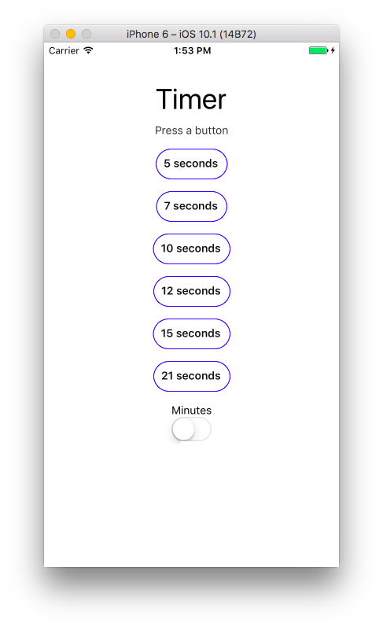

footer: © Node.University, 2016
slidenumbers: true

---

# React Native
## Mobile Development for Beginners

---

# Code along and take notes

---

# This talk is based on my open source books

---

---

## Most intros are boring 🙄

---

## Just enough for you to see that I have expertise with JavaScript

---

# About Presenter

---

^Wrote and published 12 books not counting Korean, Chinese, Polish and Russian translations

---

Azat Mardan

Twitter: @azat_co
Email: hi@azat.co
Blog: webapplog.com

---

# About Presenter

* Work: Technology Fellow at Capital One (kind of a big deal)
* Experience: FDIC, NIH, DocuSign, HackReactor and Storify
* Books: React Quickly, Practical Node.js, Pro Express.js, Express.js API and 8 others
* Teach: [NodeProgram.com](http://NodeProgram.com)
* Master of Science from University of Northern Virginia

---

# Capital One in Top 10 US Banks

---

# Mobile Development

---

# Native

---

# Responsive

---

# Flash

---

# Hybrid

---

* Apache Cordova / PhoneGap
* Ionic
* Phonon

---

# Downsides of Hybrid

* Slow
* Not all hardware features
* UX/UI is not as good as native

^Facebook main app switched away from Hybrid

---

# Native with JavaScript

---

* Titanium Appcelerator
* React Native
* NativeScript

---

# Advantages of React Native

* Trully Native
* Use JavaScript
* Allow for code reuse
* Better DX

^Facebook Ads, Pages

---

# React Native

* No re-compile
* Shared components between iOS and Android 💙
* Great DX familiar to web: ~CSS, JSX, npm, Chrome Dev Tools, etc.

---

# Timer App

<https://github.com/azat-co/react-native-quickly>

---

---

# Demo

---

# Summary

---

* Code re-use
* Faster Development
* Push updates without App Store / G Play

---

# One Last Thing 👉

---

<http://node.university>

---

# Slides & Code :page_facing_up: 💻

Free ebook, slides and code: <https://github.com/azat-co/react-native-quickly>

Online video course: <http://node.university/p/react-native-quickly>

Follow Azat at @azat_co on Twitter and enroll in NodeU!